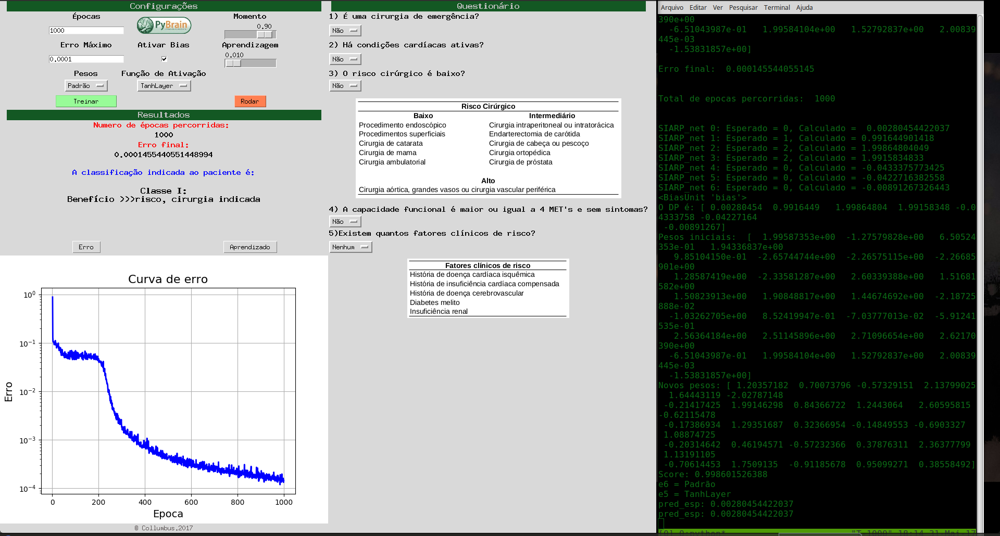

# ann_xor
This is an XOR ANN implementation with the Pybrain library and with a Tkinter GUI.

# 

This is an AAC/AHA ANN implementation with the Pybrain library and with a Tkinter GUI.

# 

## License

All Solutions licensed under MIT License. See LICENSE for further details.
